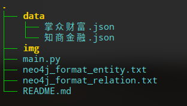
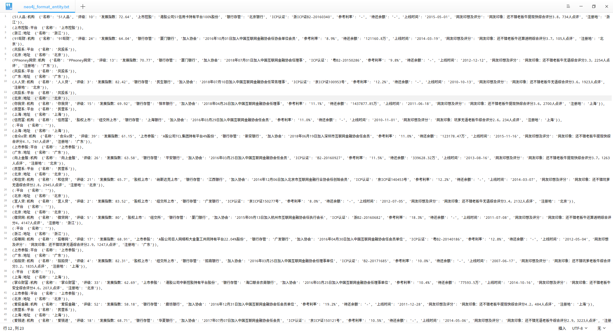
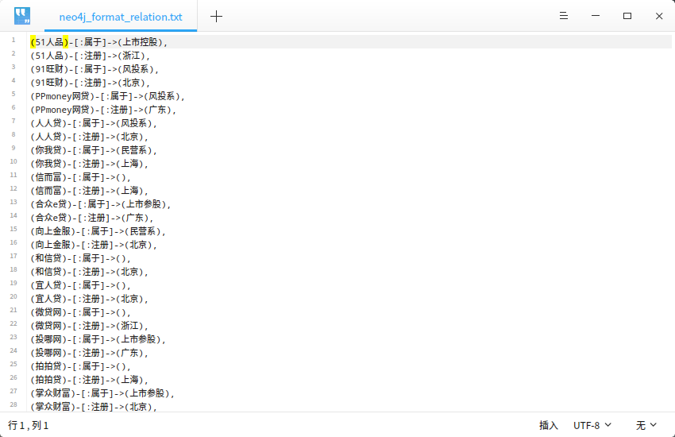

### Task

crawl from https://www.wdzj.com and build entity such as organiztion, address and platform, then build relation between organization with the others.

### Use
Auto generate file in neo4j's data format.
```python
python main.py
```
### example







